# Media Archive Tools

Tools to organize, deduplicate, and audit personal photo and video archives, with special support for NAS-based collections.

```mermaid
flowchart LR
    A["📁 Unsorted Media"]

    B["Sort by EXIF / Metadata Date"]

    C["📁 photos/2024/03/<br/>📸 img001.jpg<br/>📸 img002.png"]
    D["📁 photos/2024/03/videos/<br/>🎥 video001.mp4<br/>🎥 clip.mov"]

    A --> B
    B --> C
    B --> D
```




## Features
- Date extraction (filename → EXIF → video metadata → filesystem)
- Safe folder organization (YYYY/YYYYMM)
- Duplicate detection & removal
- NAS-friendly performance
- Dry-run support

## Usage

### Media Organizer

Move media files from source folder (`-sf`) to target folder (`-tf`) into year-month directories (`YYYY/YYYYMM`)

```bash
mat-cli organize -sf /Users/jvidal/Downloads -tf /tmp/images [--sort-events]
```

### Events subfolders

Classify photos from events into specific subfolders: `YYYY/YYYYMM/<event-name>`

```bash
mat-cli events -tf /tmp/images -ef events.yaml
```

### Photo deduplication

Look for duplicate images in a given folder, delete the duplicates.

```bash
mat-cli deduplicate [--dry-run] -tf /private/tmp/2025/202507
```


## Safety

Always run in dry-run mode first.